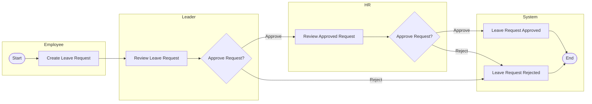

```mermaid
flowchart LR

subgraph Employee
A([Start])
B[Create Leave Request]
end

subgraph Leader
C[Review Leave Request]
D{Approve Request?}
end

subgraph HR
E[Review Approved Request]
F{Approve Request?}
end

subgraph System
G[Leave Request Approved]
H[Leave Request Rejected]
I([End])
end

A --> B
B --> C
C --> D

D -- Approve --> E
D -- Reject --> H

E --> F

F -- Approve --> G
F -- Reject --> H

G --> I
H --> I
```
