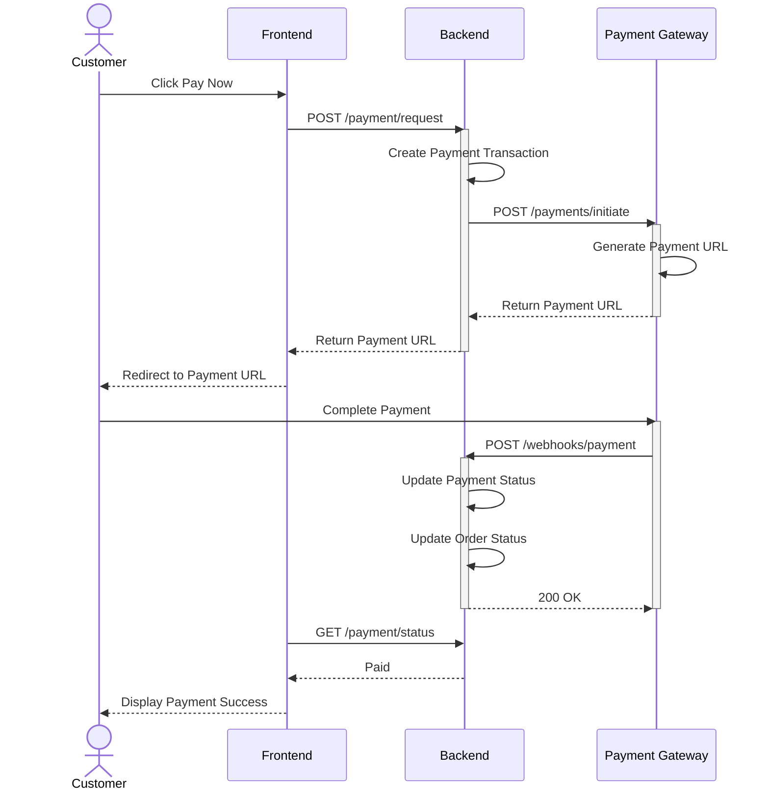

# Payment Flow Sequence Diagram

```mermaid
sequenceDiagram
    actor Customer
    participant Frontend
    participant Backend
    participant Gateway as Payment Gateway

    Customer->>Frontend: Click Pay Now
    Frontend->>Backend: POST /payment/request

    activate Backend
    Backend->>Backend: Create Payment Transaction
    Backend->>Gateway: POST /payments/initiate

    activate Gateway
    Gateway->>Gateway: Generate Payment URL
    Gateway-->>Backend: Return Payment URL
    deactivate Gateway

    Backend-->>Frontend: Return Payment URL
    deactivate Backend

    Frontend-->>Customer: Redirect to Payment URL

    Customer->>Gateway: Complete Payment

    activate Gateway
    Gateway->>Backend: POST /webhooks/payment

    activate Backend
    Backend->>Backend: Update Payment Status
    Backend->>Backend: Update Order Status
    Backend-->>Gateway: 200 OK
    deactivate Backend
    deactivate Gateway

    Frontend->>Backend: GET /payment/status
    Backend-->>Frontend: Paid
    Frontend-->>Customer: Display Payment Success
```
