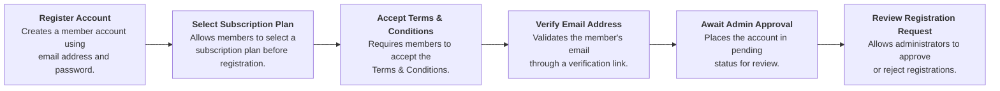

```mermaid
flowchart LR

A["<b>Register Account</b><br/>Creates a member account using<br/>email address and password."]
--> B["<b>Select Subscription Plan</b><br/>Allows members to select a<br/>subscription plan before registration."]

B --> C["<b>Accept Terms & Conditions</b><br/>Requires members to accept the<br/>Terms & Conditions."]

C --> D["<b>Verify Email Address</b><br/>Validates the member's email<br/>through a verification link."]

D --> E["<b>Await Admin Approval</b><br/>Places the account in pending<br/>status for review."]

E --> F["<b>Review Registration Request</b><br/>Allows administrators to approve<br/>or reject registrations."]
```

