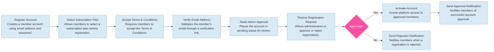

```mermaid
flowchart LR

A["Register Account<br/>Creates a member account using email address and password."]
--> B["Select Subscription Plan<br/>Allows members to select a subscription plan before registration."]
--> C["Accept Terms & Conditions<br/>Requires members to accept the Terms & Conditions."]
--> D["Verify Email Address<br/>Validates the member's email through a verification link."]
--> E["Await Admin Approval<br/>Places the account in pending status for review."]
--> F["Review Registration Request<br/>Allows administrators to approve or reject registrations."]
--> G{"Approved?"}

G -->|Yes| H["Activate Account<br/>Grants platform access to approved members."]
H --> I["Send Approval Notification<br/>Notifies members of successful account approval."]

G -->|No| J["Send Rejection Notification<br/>Notifies members when a registration is rejected."]

style A fill:#D9EAF7,stroke:#7EA6C6
style B fill:#D9EAF7,stroke:#7EA6C6
style C fill:#D9EAF7,stroke:#7EA6C6
style D fill:#D9EAF7,stroke:#7EA6C6
style E fill:#D9EAF7,stroke:#7EA6C6
style F fill:#D9EAF7,stroke:#7EA6C6
style H fill:#D9EAF7,stroke:#7EA6C6
style I fill:#D9EAF7,stroke:#7EA6C6
style J fill:#D9EAF7,stroke:#7EA6C6
style G fill:#FF4FA3,stroke:#C2185B,color:#fff
```
