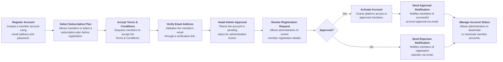

```mermaid
flowchart LR

A["<b>Register Account</b><br/>Creates a member account using<br/>email address and password."]
--> B["<b>Select Subscription Plan</b><br/>Allows members to select a<br/>subscription plan before registration."]

B --> C["<b>Accept Terms & Conditions</b><br/>Requires members to accept the<br/>Terms & Conditions."]

C --> D["<b>Verify Email Address</b><br/>Validates the member's email<br/>through a verification link."]

D --> E["<b>Await Admin Approval</b><br/>Places the account in pending<br/>status for administrative review."]

E --> F["<b>Review Registration Request</b><br/>Allows administrators to review<br/>member registration details."]

F --> G{"<b>Approved?</b>"}

G -->|Yes| H["<b>Activate Account</b><br/>Grants platform access to<br/>approved members."]

H --> I["<b>Send Approval Notification</b><br/>Notifies members of successful<br/>account approval via email."]

G -->|No| J["<b>Send Rejection Notification</b><br/>Notifies members of registration<br/>rejection via email."]

I --> K["<b>Manage Account Status</b><br/>Allows administrators to deactivate<br/>or reactivate member accounts."]

J --> K
```
