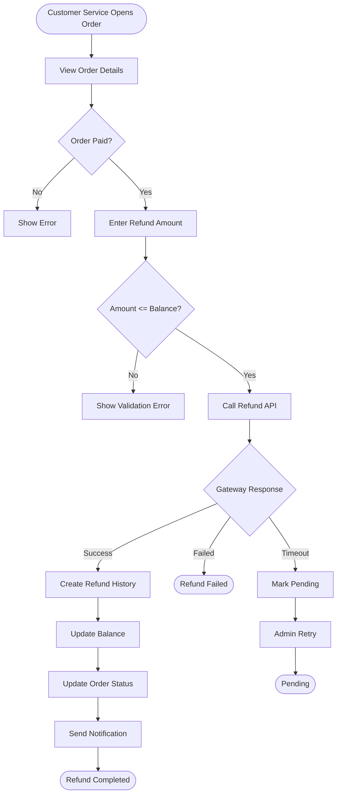

# Partial Refund BPMN

```mermaid
flowchart TD

Start([Customer Service Opens Order])
--> ViewOrder[View Order Details]

ViewOrder --> ValidateStatus{Order Paid?}

ValidateStatus -->|No| ErrorStatus[Show Error]
ValidateStatus -->|Yes| EnterRefund[Enter Refund Amount]

EnterRefund --> ValidateAmount{Amount <= Balance?}

ValidateAmount -->|No| ErrorAmount[Show Validation Error]

ValidateAmount -->|Yes| RefundAPI[Call Refund API]

RefundAPI --> GatewayResponse{Gateway Response}

GatewayResponse -->|Success| History[Create Refund History]
History --> UpdateBalance[Update Balance]
UpdateBalance --> UpdateStatus[Update Order Status]
UpdateStatus --> Notify[Send Notification]
Notify --> EndSuccess([Refund Completed])

GatewayResponse -->|Failed| EndFailed([Refund Failed])

GatewayResponse -->|Timeout| Pending[Mark Pending]
Pending --> Retry[Admin Retry]
Retry --> EndPending([Pending])
```
